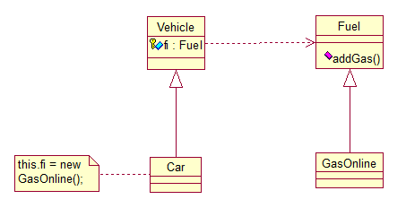
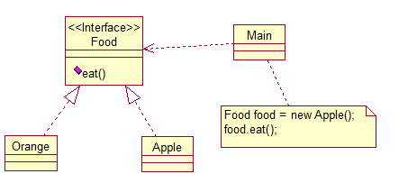

23种设计模式全解析
=======================

This document is used to indicate the program design model. I will cite **JAVA** language to show it.

----------

First. Bridge
---------

#### PS
> A Interface have the cite of B Interface, then we can new a object in the object inherate A Interface. That we can invoke the method belong the object inherate A.

> We can say the links of all the objects by Interface A & B.

#### UML graphy

Second. Command
---------

#### PS
> There are tow objects and they have common method, We can use their interface to invoke it.

#### UML graphy

----------

Environment used
---------

> Eclipse Java EE IDE for Web Developers.

> Version: Kepler Release
> Build id: 20130614-0229

> (c) Copyright Eclipse contributors and others 2005, 2013.  All rights reserved.
Visit http://www.eclipse.org/webtools
